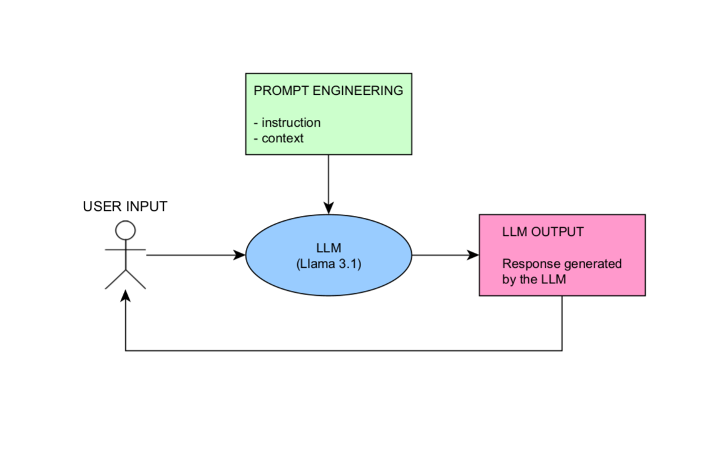

# *Sparklehorse* 

## Was ist das *Sparklehorse*?

*Sparklehorse* ist ein in Entwicklung befindlicher Chatbot. Um den Chatbot Lokal hosten zu können, wird die LLM-Distribution [Ollama](https://ollama.com/) verwendet. Der Chatbot verwendet weiterhin Metas [Llama](https://ollama.com/library/llama3.1:8b) in der kleinsten Ausführung, d.h. mit acht Bilionen Paramentern (`llama3.1:8b`).

## Entwicklung

### Aktuelles Modell: Retrieval-Augmented Generation (RAG) mit Langchain, DuckDB

*Sparklehorse* kann derzeit erste Fragen zu den Daten des Daten-Navigators des Stifterverbandes beantworten. *Sparklehorse* arbeitet dabei derzeit wie folgt:

1. **Benutzereingabe**:
   Der Nutzer gibt eine Frage oder eine Eingabe ein.

2. **Verarbeitung durch das LLM (Llama 3.1)**:
   Das Large Language Model (LLM) analysiert die Eingabe und entscheidet, ob Informationen aus einer externen Datenbank benötigt werden (ToDo).

3. **Abfrage an MAGPIE**:
   Falls Daten erforderlich sind, stellt das LLM eine SQL-Abfrage an die MAGPIE-Datenbank und erhält die entsprechenden Informationen zurück.

4. **Antwortgenerierung**:
   Das LLM kombiniert die erhaltenen Informationen aus MAGPIE mit seinem internen Wissen und erstellt eine passende Antwort.

5. **Ausgabe**:
   Die generierte Antwort wird dem Benutzer angezeigt.

#### Bewertung

- Komplexere Anfragen werden nicht in korrekte SQL-Abfragen überführt
- Jede Anfrage wird in eine SQL-Anfrage überführt
- Keine Skalierungs-Erfahrungen

#### Files

Die Konstruktion des Bots befindet sich derzeit in einen Jupyter-Notebook hier: `py\jupyther_notebooks\rag_pipleline_tutorial.ipynb`.

### Historie der Entwicklung

#### 1. Modell: QA-Model

In einem ersten Schritt wurde versucht ein [Question Answering](https://huggingface.co/tasks/question-answering) Modell per fine tuning von [roberta-base-squad2](https://huggingface.co/deepset/roberta-base-squad2) zu konstruieren. Der Vorgang war wie folgt:

1. **Benutzereingabe**:
   Der Nutzer stellt eine Frage oder macht eine Eingabe.

2. **Erstellung von Embeddings**:
   Die Benutzereingabe wird in Embeddings umgewandelt, die semantische Informationen enthalten.

3. **Abfrage an CHROMA**:
   Es wird eine Abfrage an die CHROMA-Datenbank gestellt, die bereits vorbereitete Embeddings aus der Magpie enthält.

4. **Kombination der Ergebnisse**:
   Die Embeddings aus der Benutzereingabe und den Ergebnissen von CHROMA werden kombiniert, um eine präzise Antwort zu ermöglichen.

5. **Antwortgenerierung durch QA-Modell**:
   Das QA-Modell (*roberta-base-squad2*) analysiert die Daten und erstellt eine Antwort auf die Benutzereingabe.

6. **Ausgabe**:
   Die generierte Antwort wird dem Benutzer präsentiert.

##### Bewertung

- QA-Modelle antworten im allgemeinen nicht eloquent. Sie sind nicht für Textgeneration erzeugt worden, sondern für das herausfinden und einfache Nennen abgefragter Informationen. Für das Datenportal wird aber ein Bot gewünscht, der menschenähnlich kommuniziert.
- Das trainierte QA-Modell antwortet falsch. Es bräuchte für das Finetuning vermutlich mehr Trainingsdaten.

##### Files

Die Konstruktion des QA-Modells befindet sich derzeit in einem `py`-File hier: `py\py_files\qa-model_eike.py`.

#### 2. Modell: LLM mit einfachen Prompt-Engineering

In einem zweiten Schritt wurde versucht mittels Metas [Llama](https://ollama.com/library/llama3.1:8b) und Prompt-Engineering ein adäquaten Bot zu erzeugen. Der Vorgang war dabei wie folgt:

1. **Benutzereingabe**:
   Der Benutzer stellt eine Frage oder gibt eine Eingabe in natürlicher Sprache ein.

2. **Prompt Engineering**:
   Die Eingabe wird mit zusätzlichen Informationen angereichert, darunter:
   - **Instruction**: Anweisungen, wie die Anfrage bearbeitet werden soll (Identität des Bots, Zugehörigkeit, Grenzen der Auskunftspflicht usw.)
   - **Context**: Kontext, der für die Anfrage relevant ist (Informationen zum Datennavigator).

3. **Verarbeitung durch LLM (Llama 3.1)**:
   Das Large Language Model analysiert die angereicherte Eingabe und erstellt eine Antwort basierend auf den Anweisungen und dem Kontext.

4. **Antwortausgabe**:
   Die vom LLM generierte Antwort wird dem Benutzer präsentiert.

 

 ##### Bewertung

- Modell antwortet eloquent
- Modell kann nicht mit komplexen Kontexten umgehen. Die Folge: Halluzination

##### Files

Das Modell findet sich in einer ShinyApp unter `shiny_app/app.py`.