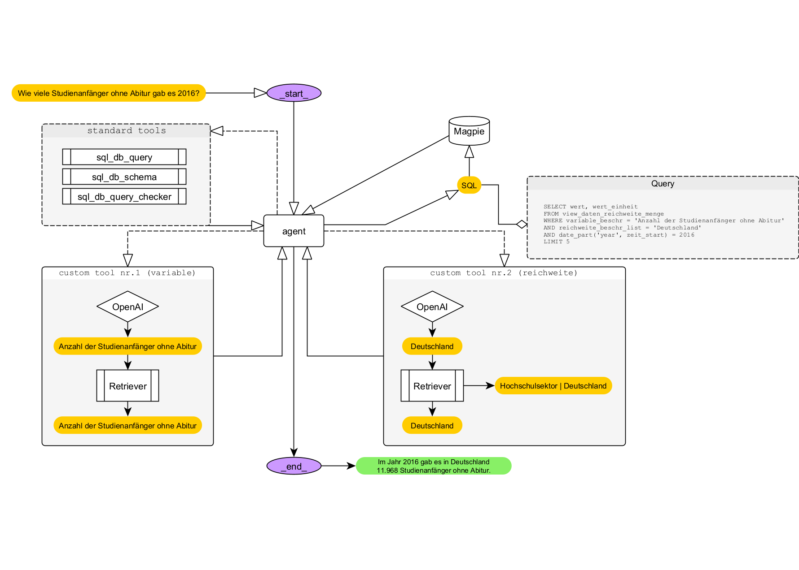

# *Sparklehorse* 

## Was ist das *Sparklehorse*?

*Sparklehorse* ist ein in Entwicklung befindlicher Chatbot der Datenbank Magpie. Um den Chatbot Lokal hosten zu können, wird die LLM-Distribution [Ollama](https://ollama.com/) verwendet. Der Chatbot verwendet derzeit die API von OpenAI. Als Agent wird `gpt-4o` verwendet, für die Embeddings `text-embedding-3-large`.

## Entwicklung

### Aktuelles Modell: Retrieval-Augmented Generation (RAG) mit Langchain, DuckDB

*Sparklehorse* kann derzeit erste Fragen zu den Daten des Daten-Navigators des Stifterverbandes beantworten. *Sparklehorse* arbeitet dabei derzeit wie folgt:

 