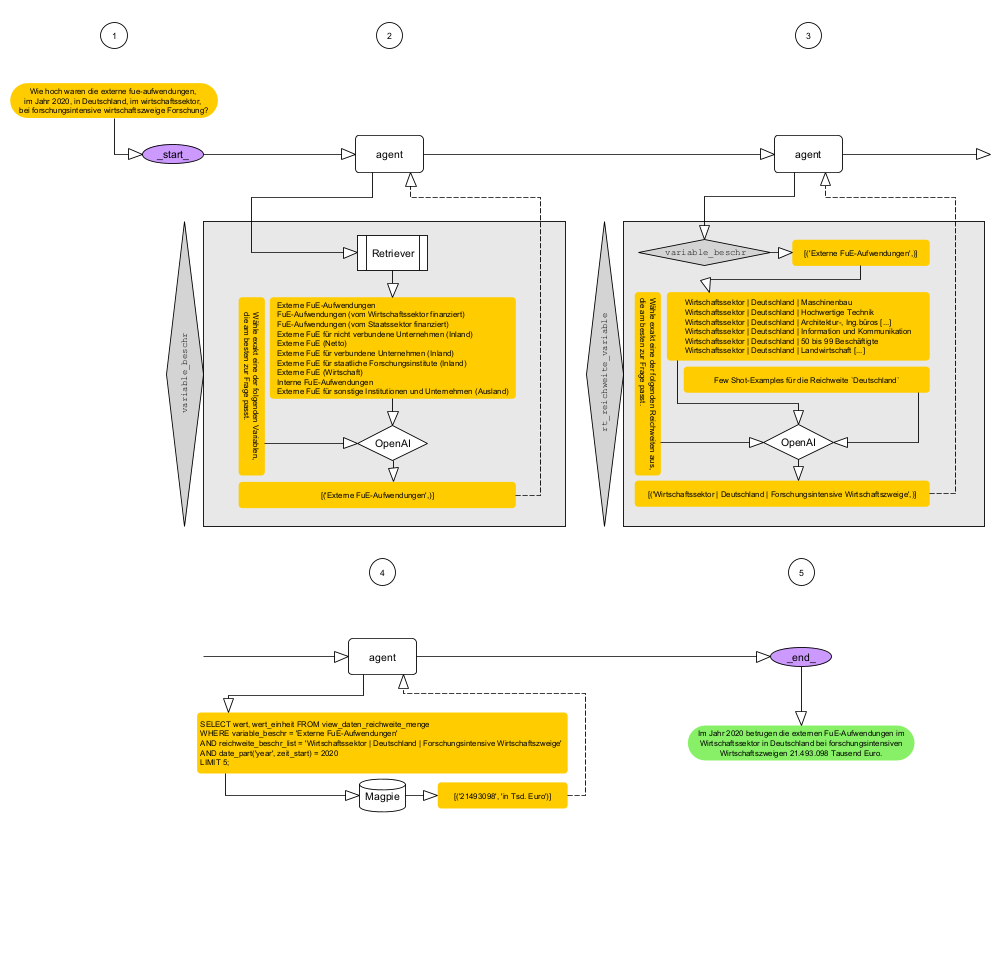

# *Sparklehorse* 


## Was ist *Sparklehorse*?

*Sparklehorse* ist ein SQL-Chatbot für die Datenbank Magpie. Er ermöglicht es, natürliche Sprache in SQL-Abfragen zu übersetzen, um Daten aus einer auf der Magpie basierenden mview abzufragen. 

Zum lokalen Hosting soll künftig die LLM-Distribution [Ollama](https://ollama.com/) genutzt werden. Der Chatbot verwendet aktuell jedoch aus Leistungsgründen die OpenAI-API mit dem Modell `gpt-4o` für die Sprachverarbeitung und `text-embedding-3-large` für semantische Such-Embeddings.

## Architektur & Funktionsweise

*Sparklehorse* arbeitet als SQL-Agent, der Nutzerfragen analysiert, relevante Variablen und Reichweiten identifiziert, die entsprechenden SQL-Abfragen generiert und ausführt. Die Antworten werden in natürlicher Sprache ausgegeben.

Das System nutzt:

- **LangChain** für Agenten und Tool-Management
- **DuckDB** als schnelle lokale Datenbank
- **Vektor-Suchmethoden** mit OpenAI-Embeddings zur semantischen Variablensuche
- **Maßgeschneiderte Tools** (`variable_beschr` und `get_reichweite_beschr_list`) für kontextsensitive Auswahl von Variablen und Reichweiten

Sparklehorse geht folgendermaßen vor: 

### Ablauf einer Nutzeranfrage in *Sparklehorse*

Das Sparklehorse geht folgendermaßen vor (vgl. Abbildung 1): 

1. **Nutzer\*innenfrage**  
   Die Nutzer\*innen stellen eine Frage, z.B.: 
   _„Wie hoch waren die externen FuE-Aufwendungen 2020 in Deutschland im Wirtschaftssektor?“_

2. **Variable-Beschreibung ermitteln**  
   Das System nutzt einen semantischen Retriever, um aus der Frage passende Variablenbeschreibungen (hier: `Externe FuE-Aufwendungen`) zu finden. Anschließend wählt ein `gpt-4o` die inhaltlich passendste Variable aus.

3. **Reichweite bestimmen**  
      Ein weiteres Tool bestimmt mithilfe von Few-Shot-Prompting und `gpt-4o` die passende Reichweite, hier `Wirtschaftssektor | Deutschland | Forschungsintensive Wirtschaftszweige`. Das Few-Shot-Prompting adressiert das Problem, dass in einigen Fällen die richtige Reichweite z.B. `Deutschland` ist, auch wenn andere Reichweiten semantisch passender erscheinen.

4. **SQL-Abfrage generieren und ausführen**  
   Basierend auf Variable, Reichweite und Zeitangabe wird eine validierte SQL-Abfrage auf der DuckDB-Mview erzeugt und ausgeführt, um die relevanten Daten abzurufen.

5. **Antwort generieren**  
   Das Ergebnis der SQL-Abfrage wird in natürliche Sprache übersetzt und dem Nutzer als Antwort zurückgegeben.




**Abb. 1:** Sparklehorse (v.0.0.1)

## Installation & Vorbereitung

1. Klone das Repository und wechsle ins Arbeitsverzeichnis:
    ```bash
    git clone <repo-url>
    cd magpie_chatbot
    ```

2. Erstelle und aktiviere die Conda-Umgebung:
    ```bash
    conda env create -f chatbot_magpie.yml
    conda activate chatbot_magpie
    ```

3. Lege deine Umgebungsvariablen an, z.B. in einer `.env`-Datei:
    ```
    OPENAI_API_KEY=dein_api_key
    ```

4. Starte den Chatbot lokal:
    ```bash
    python main.py
    ```

## Nutzung

*Sparklehorse* versteht Fragen wie:

- „Wie hoch waren die externen FuE-Aufwendungen 2020 in Deutschland?“
- „Wie viele Absolventen gab es im Jahr 2021?“
- „Was ist die Anzahl dauerhaft eingestellter Lehrkräfte?“

Die Antworten basieren auf dynamisch generierten SQL-Abfragen auf der Magpie-Datenbank.

## Tools & Komponenten

### 1. `variable_beschr`

Tool zur semantischen Identifikation der korrekten Variablen in der Datenbank aus der Nutzerfrage. Nutzt Vektor-Suche und LLM, um die beste Übereinstimmung zu finden.

### 2. `get_reichweite_beschr_list`

Tool zur Ermittlung der passenden Reichweite (Region, Organisation etc.) basierend auf der Nutzerfrage und den gültigen Einträgen in der Datenbank. Nutzt Few-Shot-Prompting und semantische Suche.

### 3. ReAct-Agent

Ein speziell konfigurierte SQL-Agent, der SQL-Abfragen strikt nach vorgegebenen Regeln erstellt und nur validierte Variablen und Reichweiten verwendet.

## Beispiel

```python
question = "Wie hoch waren die externe fue-aufwendungen, im Jahr 2020, in Deutschland, im wirtschaftssektor, bei forschungsintensive wirtschaftszweige Forschung?"
stream_agent_with_check(question)
```

## Weiterentwicklung & ToDos

- Update der mview in DuckDB
- `py`-file um den Chatbot jenseits des Jupyternotebooks zu starten
- Verbesserte Fehlerbehandlung und Nutzer-Rückfragen
- UI-Integration für einfachere Bedienung im Datennavigator des SV